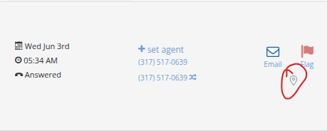

# CTM Tag

**Tag a Call Tracking Metrics call with a note, and your whole team sees it
instantly.** CTM Tag adds a small pin button to every call in CTM. Click it,
type a note or question, and everyone with the extension sees that tag in real
time — right inside CTM, no refresh.

> 💡 **This is different from CTM's own red "Flag" button.** Tagging a call here
> doesn't change anything in CTM — it just shares a private note with your
> teammates who also have CTM Tag installed.

---

## 📥 Installing (about 2 minutes — no accounts, no coding)

You don't set up anything with Firebase and you don't build anything. You just
turn the extension on.

You should have received a file called **`ctm-tag-extension.zip`** (from Slack,
email, or a shared drive). Have it handy.

> Works in **Microsoft Edge** and **Google Chrome** — steps are nearly
> identical; differences are noted.

### Steps

1. **Unzip the file.** Double-click **`ctm-tag-extension.zip`**. You'll get a
   folder named **`ctm-tag-extension`**.
   📌 **Put it somewhere permanent** (e.g. Documents) and **don't delete or move
   it** — the extension runs from this folder.

2. **Open your Extensions page:**
   - **Edge:** click the **`···`** menu (top-right) → **Extensions** → **Manage
     extensions**. *(Or type `edge://extensions` in the address bar.)*
   - **Chrome:** type `chrome://extensions` in the address bar.

3. **Turn on "Developer mode"** (a switch on the page).
   - **Edge:** bottom-left corner. **Chrome:** top-right corner.

4. **Click "Load unpacked"** and select the **`ctm-tag-extension`** folder you
   unzipped. *(Pick the folder that has `manifest.json` inside it.)*

5. **Done! ✅** Open Call Tracking Metrics — you'll see the pin buttons appear.

That "developer extensions" notice Edge/Chrome shows is **normal** for tools
installed this way. You can keep it.

---

## 📍 Where to find it in CTM

Each call gets a small **pin icon** (circled in red below), next to CTM's own
Email and Flag buttons:

And at the **top of the page** there's a **"Tagged Calls"** button with a count
badge. Click it to slide down a list of every tagged call.

---

## 🏷️ How to use it

- **Tag a call:** click the **pin** on a call row → type a note → click
  **"Tag it."** The pin turns amber to show it's tagged.
- **Read or delete a tag:** click an amber pin to see the note, who added it, and
  when — with a **"Delete tag"** option.
- **See all tagged calls:** click the **"Tagged Calls"** button at the top. The
  panel lists every tag (newest first) with:
  - the note and who tagged it,
  - **"→ Go to call"** — jumps to that call on the page and highlights it,
  - **"✕ Remove"** — deletes the tag.
- **It's live for everyone.** When you add or remove a tag, your teammates see
  it within about a second, and you see theirs — no refresh needed.

The first time you tag a call, it asks for **your name** (so teammates know who
tagged it). Type it once — you can change it anytime from the panel header.

---

## 🛠️ Troubleshooting

- **No pins on the calls?** Make sure you're on a CTM page that lists calls. If
  they're still missing, press **F12** → **Console** tab, look for lines that
  start with **`[CTM Tag]`**, and send a screenshot to whoever shared the
  extension with you — those messages say exactly what to fix.
- **Got an updated zip?** Unzip it over the old folder (replace the contents),
  then on the Extensions page click the **↻ reload** icon on the CTM Tag card.

---

*Setting this up for your team for the first time, or want to change how it
works? See [DEVELOPER.md](DEVELOPER.md).*
